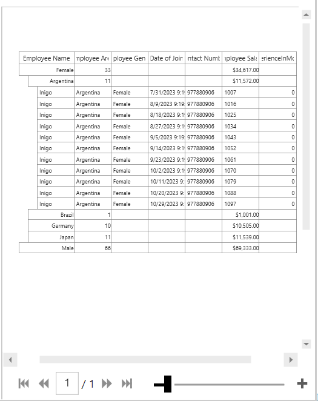

# how-to-format-wpf-datagrid-caption-summary-in-print-preview

This sample show cases how to format [WPF DataGrid](https://www.syncfusion.com/wpf-ui-controls/datagrid) (SfDataGrid) CaptionSummary in PrintPreview?

The caption summary content and style will not be rendered in the PrintPreview dialog of [WPF DataGrid](https://www.syncfusion.com/wpf-ui-controls/datagrid) (SfDataGrid). To format CaptionSummary styles in PrintPriview, a custom print manager can be inherited from `GridPrintManager` and the `GetPrintCaptionSummaryCell` method can be overridden to update the style.

```C#
public class CustomPrintManagerBase : GridPrintManager
{
    public CustomPrintManagerBase(SfDataGrid dataGrid) : base(dataGrid)
    {

}
//To Return proper cell for caption summary cells
    public override ContentControl GetPrintCaptionSummaryCell(object group, string mappingName)
    {
        var cell = base.GetPrintCaptionSummaryCell(group, mappingName);
        cell.HorizontalAlignment = HorizontalAlignment.Right;
        cell.HorizontalContentAlignment = HorizontalAlignment.Right;
        return cell;
}
}

//To assign the custom print manager to grid when print preview is initialized at run time.
dataGrid.PrintSettings.PrintManagerBase = new CustomPrintManagerBase(dataGrid);
```



KB article - [how-to-format-wpf-datagrid-caption-summary-in-print-preview](https://github.com/SyncfusionExamples/how-to-format-wpf-datagrid-caption-summary-in-print-preview/edit/main/README.md)
